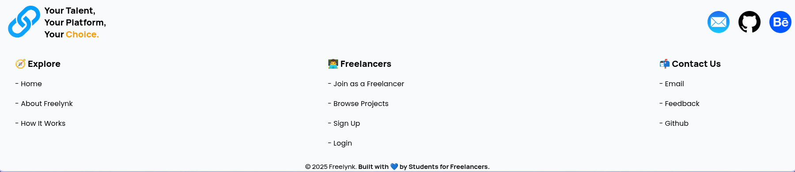

# Freelancing Platform

A simple freelancing web application developed as a mini project to connect freelancers and employers for project-based work. The platform demonstrates the core workflow of freelance marketplaces like Upwork, focusing on clean UI, interactivity, and smooth user experience.

---

## 🌐 Live Demo

✅ [View the Live Site](https://freelynk.onrender.com)

---

## 🚀 Project Overview

In today’s growing gig economy, there’s a significant need for platforms that connect skilled freelancers with employers seeking flexible, short-term talent. This project simulates a basic freelancing portal where:

- **Employers can post projects**
- **Freelancers can browse available jobs**
- **Freelancers can submit applications**

Though simplified, it provides a foundation for developing more advanced features in the future.

---

## 📸 Screenshots

  




---

## ⚙️ Installation & Local Setup

You can run this project locally without any build tools.  
Below are two options:

### 🟢 1. Clone the Repository

```
git clone https://github.com/saipuneeth2706/freelancing-platform.git
```

Then navigate into the project folder:

```
cd freelancing-platform
```

### 🟢 2. Run with Python HTTP Server

Make sure you have **Python installed** (Python 3 recommended).

#### For Python 3.x:

```
python -m http.server 8000
```

#### For Python 2.x:

```
python -m SimpleHTTPServer 8000
```

Then, open your browser and go to:

```
http://localhost:8000
```

---

## 🎨 Figma Design

You can preview the design mockups here:

[View Figma Design](https://www.figma.com/design/vU5CsUEJI7YJj6spd4ihL4/Freelynk?node-id=143-3&t=eQmJpV7lIaY9rbNl-4)

---

## 🛠️ Tech Stack

- **Frontend:** HTML, CSS, Vanilla JavaScript
- **Animations:** GSAP (GreenSock Animation Platform)
- **Smooth Scrolling:** Lenis
- **Hosting:** Render

---

## ✨ Features

✅ Employers can upload new project listings  
✅ Freelancers can browse job opportunities  
✅ Freelancers can submit applications via interactive forms  
✅ Smooth scrolling and engaging animations  
✅ Responsive design for all devices  
✅ Clean, modular code structure  

---

## 📁 Project Structure

```
/index.html
/css/
/js/
/assets/
/screenshots/
/README.md
```

- `index.html` — Main entry point  
- `/css/` — Stylesheets  
- `/js/` — JavaScript logic  
- `/assets/` — Images and icons  
- `/screenshots/` — Project screenshots

---

## 🔐 Security & Limitations

- Data is handled client-side only; no persistent database or authentication is implemented.
- No payment processing or sensitive data storage.
- Libraries are loaded via CDN.

Future plans include:
- Backend integration
- Secure user accounts
- Escrow payments
- Multilingual support

---

## 📚 References

- [MDN Web Docs](https://developer.mozilla.org/)
- [GSAP Documentation](https://gsap.com/docs/)
- [Lenis Documentation](https://lenis.studiofreight.com/)
- [W3Schools](https://www.w3schools.com/)
- [Render Hosting](https://render.com/)
- [Git](https://git-scm.com/)
- [GitHub](https://github.com/)
- [Stack Overflow](https://stackoverflow.com/)

---

## 🤝 Contributions

This project was created for educational purposes as part of a college mini project.  
Feel free to fork the repository, explore, and suggest improvements.

---

## 📄 License

This project is licensed for educational and demonstration use only.
